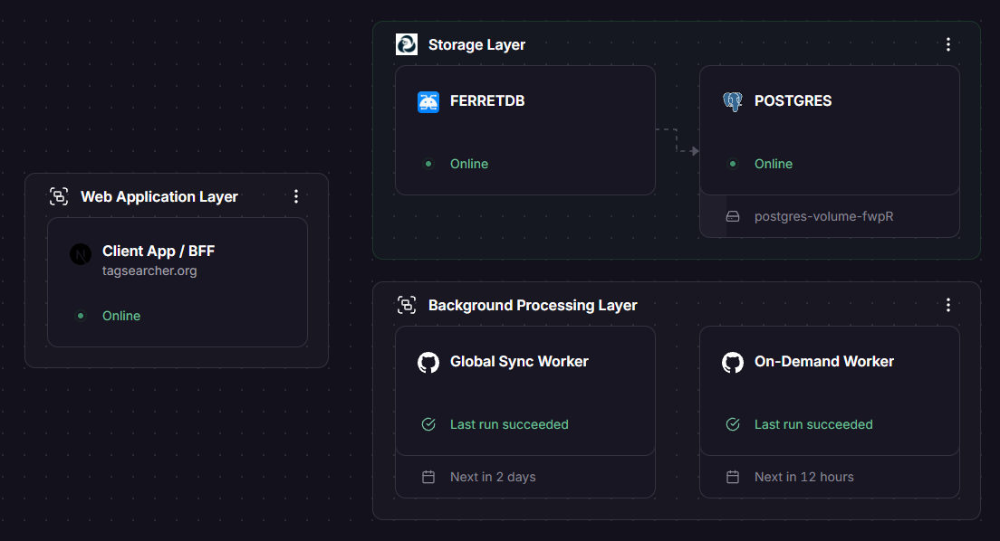

# Tag Searcher

## System Architecture



The project architecture consists of three main layers:

- **Web Application Layer** — Client App / BFF built with Next.js (tagsearcher.org).
- **Storage Layer** — PostgreSQL as the primary database with FerretDB proxy for document-based access.
- **Background Processing Layer** — GitHub Actions workers (Global Sync Worker and On-Demand Worker) for state and server synchronization.

---

This is a [Next.js](https://nextjs.org) project bootstrapped with [`create-next-app`](https://github.com/vercel/next.js/tree/canary/packages/create-next-app).

## Getting Started

First, run the development server:

```bash
npm run dev
# or
yarn dev
# or
pnpm dev
# or
bun dev
```

Open [http://localhost:3000](https://www.google.com/search?q=http://localhost:3000) with your browser to see the result.

You can start editing the page by modifying `app/page.js`. The page auto-updates as you edit the file.

This project uses [`next/font`](https://nextjs.org/docs/app/building-your-application/optimizing/fonts) to automatically optimize and load [Geist](https://vercel.com/font), a new font family for Vercel.

## Learn More

To learn more about Next.js, take a look at the following resources:

- [Next.js Documentation](https://nextjs.org/docs) — learn about Next.js features and API.
- [Learn Next.js](https://nextjs.org/learn) — an interactive Next.js tutorial.

You can check out [the Next.js GitHub repository](https://github.com/vercel/next.js) — your feedback and contributions are welcome!

## Contributing

Contributions are welcome! Feel free to open issues or submit pull requests at [https://github.com/FyFka/tag-searcher/](https://github.com/FyFka/tag-searcher/).
